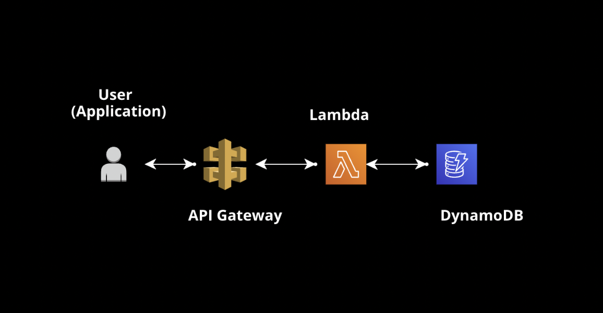
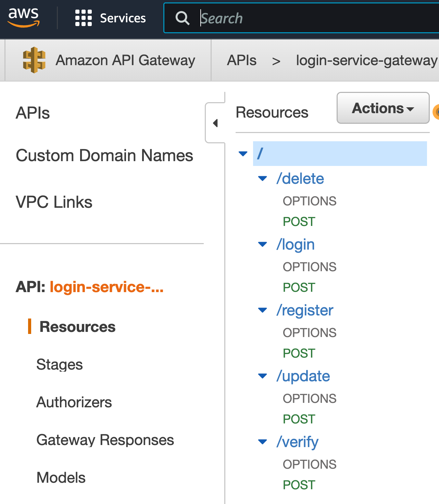
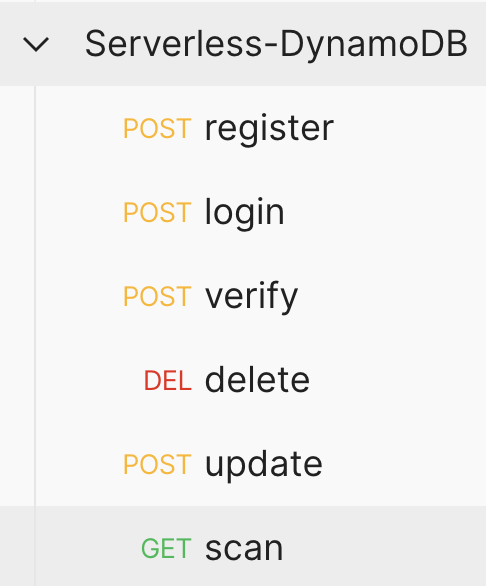
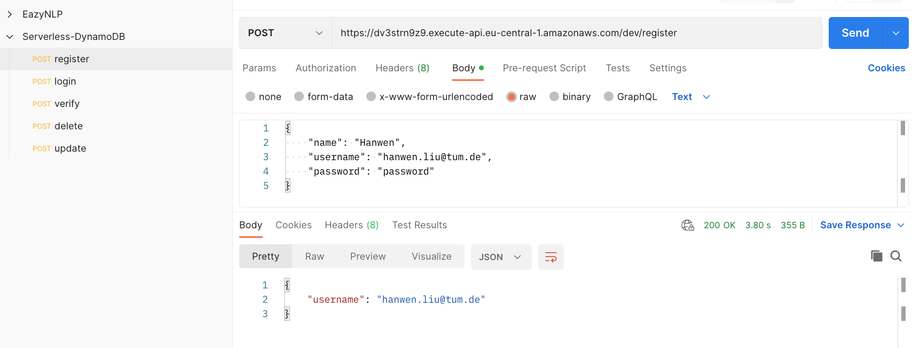
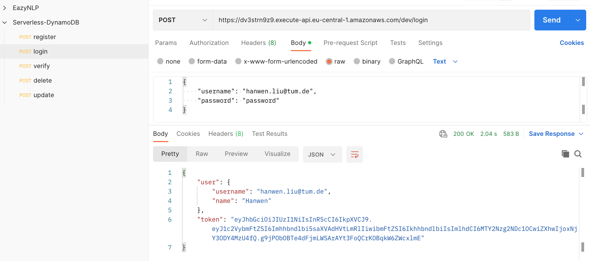
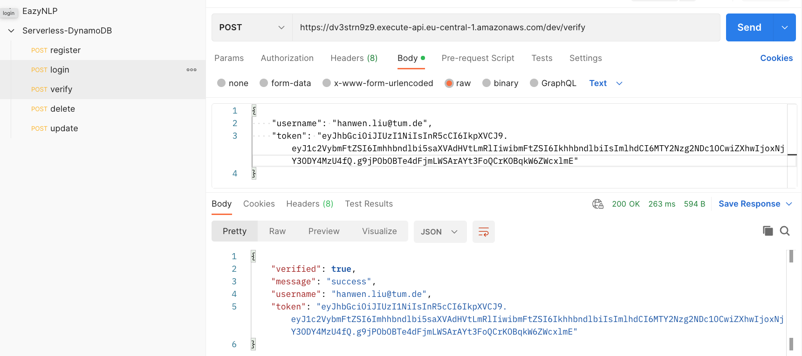
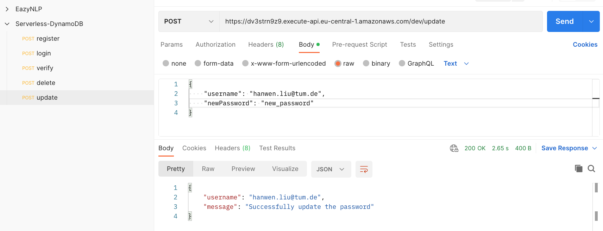
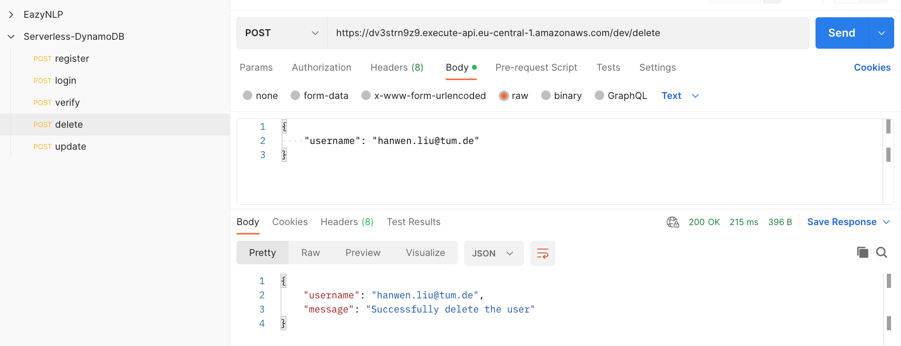
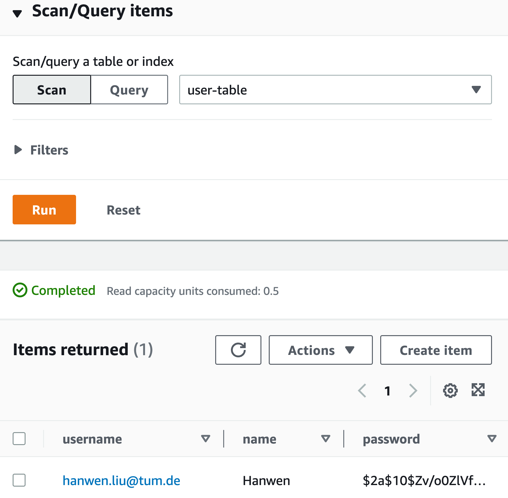

# Serverless-DynamoDB-Login
**Login System Design with Serverless and DynamoDB**

### Project Overall Architecture

In this project, we will use **API Gateway**, **Lambda,** and **DynamoDB**.

- Programming Language: JavaScript

- The API version of `aws-sdk` is `v2` 

  [Document - AWS SDK v2](https://docs.aws.amazon.com/sdk-for-javascript/v2/developer-guide/welcome.html)

- **Postman** is used to test the api

### Functions Demo

##### /register

##### /login

##### /verify

##### /update

##### /delete

We can also check the result from the DynamoDB Website.

